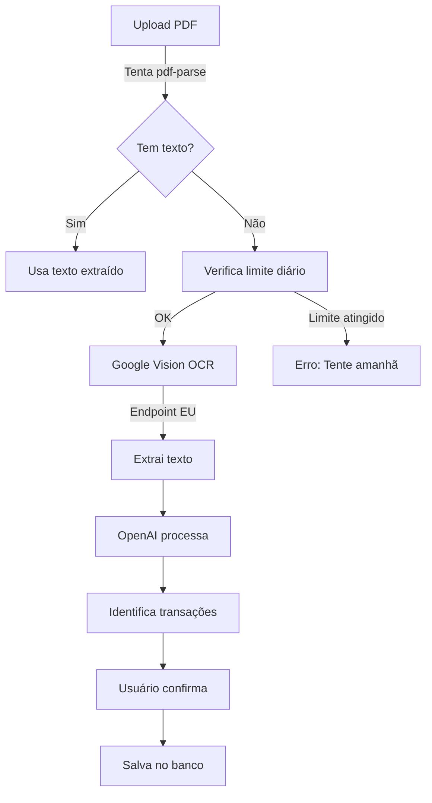

# 🔍 Google Cloud Vision OCR - Configuração Região EU

## Por que Google Vision OCR?

- **OCR poderoso**: Reconhece texto em PDFs escaneados e imagens
- **Região EU disponível**: Processamento GDPR-compliant
- **Custo-efetivo**: Mais barato que Document AI para OCR simples
- **API simples**: Fácil integração com Node.js

## Diferença entre Vision API e Document AI

| Feature | Vision API OCR | Document AI |
|---------|---------------|-------------|
| **Uso ideal** | OCR simples, extração de texto | Processamento complexo de documentos |
| **Preço** | $1.50 por 1000 imagens | $1.50+ por 1000 páginas |
| **Complexidade** | Simples | Avançado |
| **Nosso caso** | ✅ Perfeito para extratos/faturas | Desnecessário |

## Configuração Passo a Passo

### 1. Ativar Vision API

```bash
# Via CLI
gcloud services enable vision.googleapis.com

# Ou acesse o Console:
# https://console.cloud.google.com/apis/library/vision.googleapis.com
```

### 2. Criar Service Account

```bash
# Criar service account
gcloud iam service-accounts create vision-ocr-service \
    --display-name="Vision OCR Service Account"

# Dar permissões
gcloud projects add-iam-policy-binding YOUR_PROJECT_ID \
    --member="serviceAccount:vision-ocr-service@YOUR_PROJECT_ID.iam.gserviceaccount.com" \
    --role="roles/cloudvision.user"
```

### 3. Baixar Credenciais JSON

1. Acesse [Service Accounts](https://console.cloud.google.com/iam-admin/serviceaccounts)
2. Clique na service account criada
3. **Keys** → **Add Key** → **Create new key** → **JSON**
4. Salve como `google-credentials.json`

### 4. Configurar .env

```env
# Google Cloud Vision OCR
GOOGLE_CLOUD_PROJECT_ID=seu-project-id
GOOGLE_CLOUD_REGION=eu
GOOGLE_APPLICATION_CREDENTIALS=./google-credentials.json
GOOGLE_AI_DAILY_LIMIT=50

# OpenAI (para processamento do texto extraído)
OPENAI_API_KEY=sk-...
```

### 5. Estrutura de Código Implementada

```javascript
// Nossa implementação em route.ts
const vision = await import('@google-cloud/vision')

// Cliente com endpoint EU
const client = new vision.ImageAnnotatorClient({
  projectId: projectId,
  keyFilename: resolvedCredentialsPath,
  apiEndpoint: 'eu-vision.googleapis.com', // Endpoint EU!
})

// OCR em PDF
const [result] = await client.documentTextDetection({
  image: {
    content: buffer, // PDF em buffer
  },
})

// Texto extraído
const text = result.fullTextAnnotation?.text
```

## Endpoints Regionais

| Região | Endpoint | Conformidade |
|--------|----------|--------------|
| **EU** | `eu-vision.googleapis.com` | ✅ GDPR |
| US | `vision.googleapis.com` | ❌ Fora da EU |
| Asia | `asia-vision.googleapis.com` | ❌ Fora da EU |

## Custos (Região EU)

### Vision API OCR
- **Primeiras 1000 unidades/mês**: Grátis
- **Após 1000 unidades**: €1.50 por 1000 unidades
- **1 página PDF = 1 unidade**

### Exemplo de Custo Mensal
- 100 PDFs/dia × 30 dias = 3000 PDFs
- Primeiras 1000: €0
- Próximas 2000: €3.00
- **Total: €3.00/mês**

## Troubleshooting

### Erro: "The Vision API has not been enabled"

```bash
gcloud services enable vision.googleapis.com
```

### Erro: "Insufficient permission"

```bash
# Adicionar role correto
gcloud projects add-iam-policy-binding YOUR_PROJECT_ID \
    --member="serviceAccount:YOUR_SERVICE_ACCOUNT_EMAIL" \
    --role="roles/cloudvision.user"
```

### Erro: "Invalid image content"

PDFs grandes podem falhar. Nossa implementação já lida com isso usando `documentTextDetection` ao invés de `textDetection`.

### Verificar Configuração

```javascript
// Test script
const vision = require('@google-cloud/vision');

async function testVisionOCR() {
  const client = new vision.ImageAnnotatorClient({
    keyFilename: './google-credentials.json',
    apiEndpoint: 'eu-vision.googleapis.com'
  });
  
  // Testar com texto simples
  const [result] = await client.textDetection({
    image: {
      content: Buffer.from('Test image with text', 'utf8')
    }
  });
  
  console.log('OCR funcionando!', result);
}

testVisionOCR().catch(console.error);
```

## Monitoramento de Uso

### Dashboard de Custos
- [Vision API Metrics](https://console.cloud.google.com/apis/api/vision.googleapis.com/metrics)
- Configure alertas de quota

### Nosso Controle Interno

```sql
-- Tabela google_ai_usage criada pela migration
SELECT * FROM google_ai_usage 
WHERE date = CURRENT_DATE;
```

## Segurança

### ✅ Boas Práticas Implementadas

1. **Região EU**: Dados processados na Europa
2. **Sem armazenamento**: PDFs não são salvos
3. **Limite diário**: Controle de custos
4. **Credenciais seguras**: Nunca commitadas

### ⚠️ Importante

```gitignore
# Adicionar ao .gitignore
google-credentials.json
.env
*.pdf
```

## Fluxo Completo do Sistema



## Comparação: Nossa Implementação

### Antes (Document AI - Errado)
```javascript
// ❌ Tentava usar Document AI
const { DocumentProcessorServiceClient } = await import('@google-cloud/documentai')
// Precisava de processor ID, região específica, etc.
```

### Agora (Vision API - Correto)
```javascript
// ✅ Usa Vision API
const vision = await import('@google-cloud/vision')
const client = new vision.ImageAnnotatorClient({
  apiEndpoint: 'eu-vision.googleapis.com'
})
// Simples e funcional!
```

## Links Úteis

- [Vision API Docs](https://cloud.google.com/vision/docs)
- [Preços](https://cloud.google.com/vision/pricing)
- [Quotas](https://cloud.google.com/vision/quotas)
- [Amostras de Código](https://github.com/googleapis/nodejs-vision)

---

✨ **Sistema configurado e pronto para usar Google Vision OCR na região EU!**